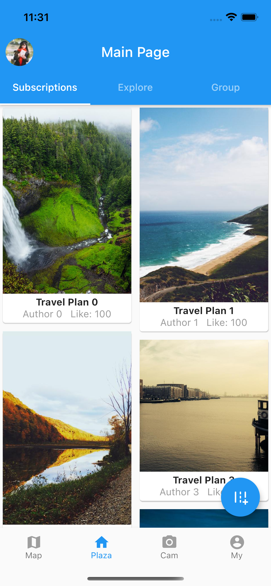
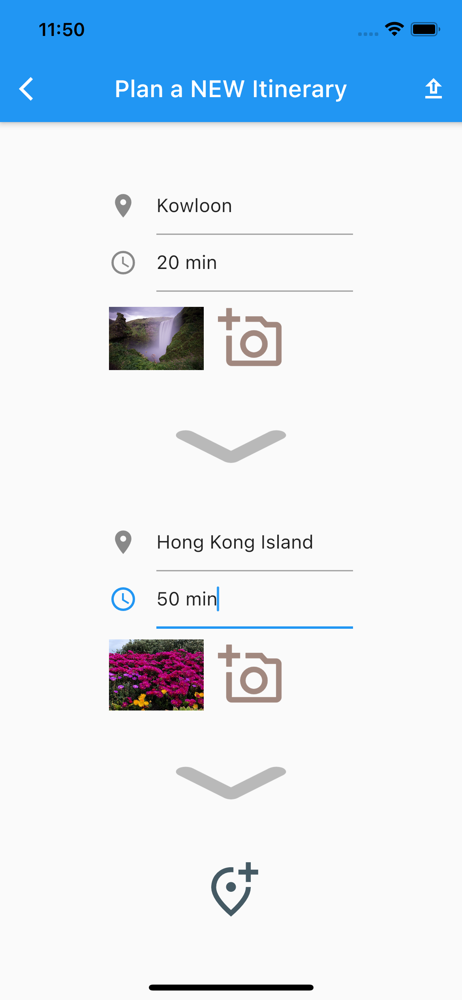
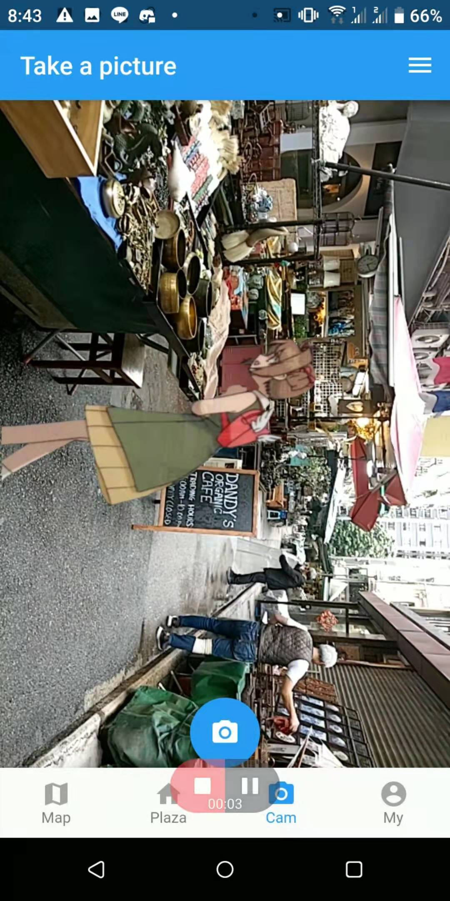
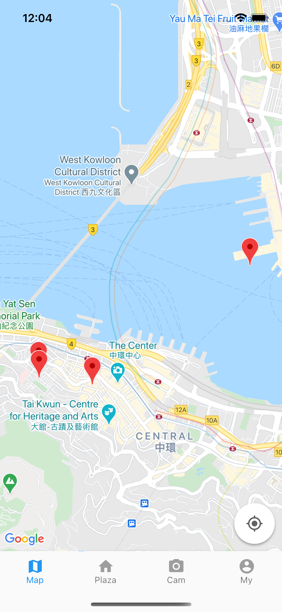

# hackust_traveling

2021 HackUST App of Group `Vegeken`


- [hackust_traveling](#hackust_traveling)
  - [Environment](#environment)
  - [Quick Start](#quick-start)
  - [Content](#content)


## Environment 
Our App is build from `Flutter 2.0.4` and can operate on Ios, Android and Chrome Web.
Other dependencies are under `pubspec.yaml`.

## Quick Start
After the environment setup, you can simply type the following command (e.g on iOS):

    ```shell
    # open the simulator
    open -a Simulator
    # Run the App
    flutter run
    ```
## Content
1. Your directory tree should look like this
   ```
   ${ROOT}
   ├── android
   ├── assets
   ├── ios
   ├── lib
   ├── test
   ├── web
   ├── README.md
   ├── pubspec.lock
   └── pubspec.yaml
   ```
2. Our main UI Code is under the `lib` Folder with the following structure:
   ```
    ${POSE_ROOT}
    |-- lib
    `-- |-- Pages
        |   |-- camera_page.dart
        |   |-- form_group.dart
        |   |-- my_page.dart
        |   |-- plan_new_trip.dart
        |   |-- plaza_page.dart
        |   |-- shengdi_data.dart
        |   |-- shengdi_detail.dart
        |   |-- shengdi_page.dart
        |   `-- travel_page.dart 
        `-- navigator
        |   |-- bottom_navigator.dart
        `-- globols.dart
        |
        `-- main.dart
    ```
3. Our App's functions Can be divided into four parts:The first is the Plaza Page.  
    1. Within the Plaza, people can explore differnt Travel Plan posted by others and see how many people loves this plan.
       
    
    2. People can also change the tab bar on the top to `Group`. In the Group Page, People are able to see Group Forming information posted by other travellers. Then you are able to explore and join them.
    
    3. Forward, you can add a new plan by click the button on the right-bottom corner  
      
    
    4. You can memorable pictures. Currently a static watermark is implemented.  
      
    
    5. In addition, you can explore attractions in our map.  
    
